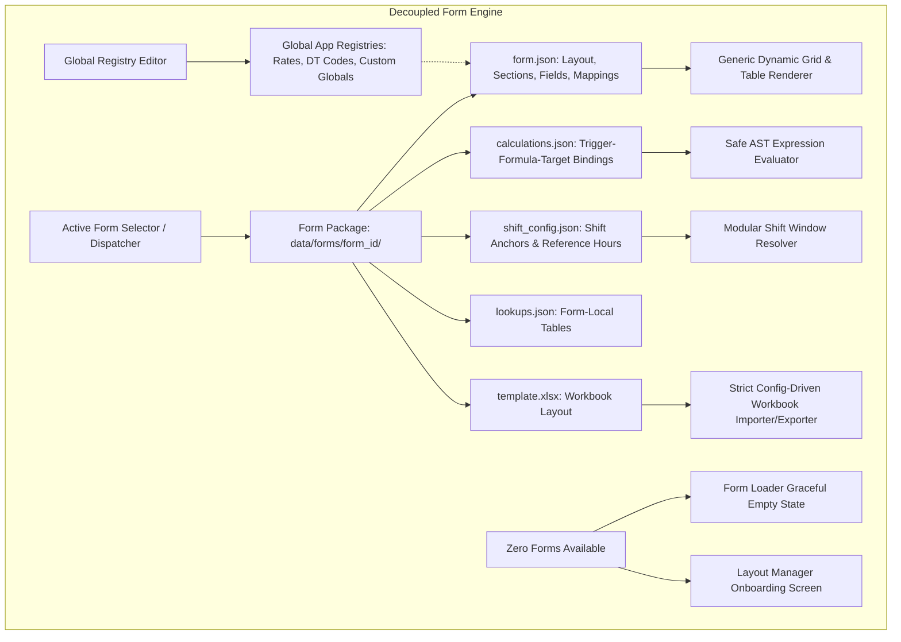

# Decouple Digital Form Engine and Global Registry System Master Plan

> **Status**: 📋 In Progress / Ready for Execution  
> **Target Version**: 2.6.0  
> **Initiation Trigger Keyword**: `EXECUTE_DECOUPLE_FORM_ENGINE_PLAN`  
> **Owner**: Core Architecture Team  
> **Last Updated**: August 2026

---

## Executive Summary & Vision

This master plan governs the complete architectural decoupling of **AIMartinSuiteGLCVersion** into a generic, portable, and transferable **Create / Modify / Fill / Export digital form management platform**.

Historically, the application originated as a single-purpose "GLC Production Log" with form loading added incrementally. This led to deep code-level coupling:
* Implicit injection of "Production Rows" and "Downtime Rows" when forms omit them.
* Hard-coded formulas and date derivations in Python (`cast_date` Julian calculations, shift window calculations).
* Hardcoded footer metrics (`EFF%`, `Ghost Time`) and specialized actions ("Balance Downtime").
* Monolithic lookup handling specifically wired to part rates.
* Hard errors when zero forms are available to load.

This plan removes all implicit defaults and establishes:
1. **Self-Contained Form Packages**: Each form resides in `data/forms/<form_id>/` with its own `form.json`, `calculations.json`, optional `shift_config.json`, optional `lookups.json`, and optional `template.xlsx`.
2. **Zero-Defaults Loading Policy**: Forms load strictly and exclusively what is defined in their JSON package. If a form defines only 1 custom table, only that table is loaded.
3. **Declarative Calculations Engine**: Calculations run via event triggers and safe AST expressions bound to target fields.
4. **Global Registry Editor**: The Rate Manager evolves into a multi-dataset Global Registry Manager (supporting Part Rates, Downtime Codes, and custom global tables) with full CRUD.
5. **Packaged Starter Forms & Soft-Deletion**: Standard starter forms are packaged and can be soft-deleted (`hidden_builtin_forms` in `settings.json`) or restored without breaking file integrity.
6. **Graceful Empty State**: Both Form Loader and Layout Manager handle 0-form states cleanly with dedicated onboarding/restore views.
7. **Automated Legacy Form Migration with Backup**: Pre-existing forms in `data/forms/` and `layout_config.json` are automatically backed up and upgraded into the new multi-file bundle format.

---

## Architecture Specification



---

## Phased Execution Roadmap

### Phase 1: Form Package Registry, Soft-Delete & Migration Engine
* **Goal**: Establish the `data/forms/<form_id>/` multi-file bundle standard and soft-delete/migration mechanics.
* **Target Files**:
  * `app/form_definition_registry.py`
  * `app/layout_config_service.py`
* **Deliverables**:
  * Unified bundle path resolution for `form.json`, `calculations.json`, `shift_config.json`, `lookups.json`, and `template.xlsx`.
  * Soft-delete tracking in `settings.json` via `hidden_builtin_forms`.
  * `restore_builtin_forms()` to reset or unhide packaged forms.
  * Automated migration from single-file JSON with timestamped backups in `data/backups/forms/migration_<timestamp>/`.
  * Graceful handling when `list_forms()` is empty (returning `None` instead of raising exceptions).

---

### Phase 2: Elimination of Implicit Default Injections
* **Goal**: Enforce zero-default rendering so forms only contain what is explicitly declared.
* **Target Files**:
  * `app/models/production_log_model.py`
  * `app/data_handler_service.py`
  * `app/models/layout_manager_model.py`
* **Deliverables**:
  * Remove all automatic fallbacks to `DEFAULT_PRODUCTION_ROW_FIELDS`, `DEFAULT_DOWNTIME_ROW_FIELDS`, and `DEFAULT_SECTIONS` in live runtime models.
  * Normalize and load strictly the sections and fields present in the form configuration.

---

### Phase 3: Generic Event-Driven Calculations & Shift Module
* **Goal**: Make formulas, derivations, and shift window calculations purely declarative.
* **Target Files**:
  * `app/safe_expression.py`
  * `app/models/production_log_model.py`
  * `app/models/production_log_calculations_model.py`
* **Deliverables**:
  * Safe AST evaluator functions for `julian_day()`, `shift_start()`, `shift_end()`, `sum_column()`, etc.
  * Declarative trigger-formula bindings in `calculations.json` (`on_field_change`, `source_fields`, `formula`, `target_field`).
  * Dedicated per-form `shift_config.json` containing anchor modes and reference times.
  * Decoupled `is_header_override_enabled()` to inspect dynamic field attributes rather than fixed IDs.

---

### Phase 4: Dynamic UI Adaptation & Empty State in Form Loader
* **Goal**: Allow Form Loader Qt view to render arbitrary section schemas and handle zero-form states without errors.
* **Target Files**:
  * `app/views/production_log_qt_view.py`
  * `app/controllers/production_log_qt_controller.py`
* **Deliverables**:
  * Graceful empty-state widget when no forms are available with **[Open Layout Manager]** and **[Restore Default Forms]** buttons.
  * Dynamic footer metrics banner rendering only the metric cards declared in form config.
  * Conditional tool action buttons based on form features.
  * Pluggable lookup resolution: local `lookups.json` first, then global application registries.

---

### Phase 5: Global Registry Editor (Rate Manager Evolution)
* **Goal**: Expand Rate Manager into a full Global Registry Manager for shared application lookup tables.
* **Target Files**:
  * `app/rate_manager.py`
  * `app/models/rate_manager_model.py`
  * `app/views/rate_manager_qt_view.py`
  * `app/controllers/rate_manager_qt_controller.py`
* **Deliverables**:
  * Rebranded to **Global Registry Editor** (`[Global Application Registry]`).
  * Dataset selector to switch between:
    * Part Number Rates (`rates.json`)
    * Downtime Codes (`downtime_codes.py` / `downtime_codes.json`)
    * Custom Global Tables (`data/config/lookups/*.json`)
  * Full CRUD UI: Create Dataset, Add Entry, Edit Entry, Delete Entry, Delete Custom Dataset, and Search/Filter.

---

### Phase 6: Layout Manager Authoring & Empty State Support
* **Goal**: Enable authoring, previewing, and saving arbitrary form schemas without hardcoded section limits.
* **Target Files**:
  * `app/models/layout_manager_model.py`
  * `app/views/layout_manager_qt_view.py`
* **Deliverables**:
  * Relax `validate_config()` to allow any combination of single and repeating sections.
  * Empty-state screen when no form is selected.
  * "Restore Packaged Forms" button in the form selector management bar.

---

### Phase 7: Strict Config-Driven Workbook Importer & Exporter
* **Goal**: Remove hardcoded sheet names and column keyword sniffing from Excel export/import.
* **Target Files**:
  * `app/data_handler_service.py`
* **Deliverables**:
  * Config-driven sheet naming (`template.sheet_name` or `form_name`).
  * Direct column mapping import/export without heuristic header scraping.

---

### Phase 8: Packaged Starter Forms & Automated Verification Suite
* **Goal**: Deliver standard bundled forms and complete unit/integration test coverage.
* **Deliverables**:
  * Standard bundles:
    * `data/forms/temp_form_title/` (Canonical GLC Production Log)
    * `data/forms/shift_activity_log/` (Generic Shift Activity Log)
    * `data/forms/inspection_checklist/` (Generic Equipment / Safety Checklist)
  * Automated test suite in `tests/test_decoupled_form_engine.py`.

---

## Validation & Verification Gate

1. **Automated Unit & Integration Tests**:
   ```powershell
   python -m unittest tests.test_decoupled_form_engine
   python -m unittest tests.test_header_override
   ```
2. **Global Registry Editor Smoke Test**:
   * Open Global Registry Editor in the host shell.
   * Add, edit, and delete entries in Part Rates and Downtime Codes.
   * Create a new custom global table (e.g. `equipment_list`), add rows, and verify persistence.
3. **Empty State & Restore Test**:
   * Hide/delete all forms.
   * Verify Form Loader and Layout Manager render informative onboarding states without crashing.
   * Click "Restore Default Forms" and verify packaged starter forms return.
4. **Decoupled Form Test**:
   * Switch to `inspection_checklist`. Confirm that only inspection fields render, without production/downtime tables or EFF%/Ghost Time labels.
5. **Legacy Form Parity Test**:
   * Switch to `temp_form_title`. Confirm all header fields, production table, downtime table, rate lookups, calculation metrics, and Excel export work identically to before.

---

## Quick Reference / Initiation Keyword

When ready to begin work on this plan in a future session, use the trigger prompt:

> **"Please start executing the Decouple Digital Form Engine Master Plan using keyword EXECUTE_DECOUPLE_FORM_ENGINE_PLAN"**
